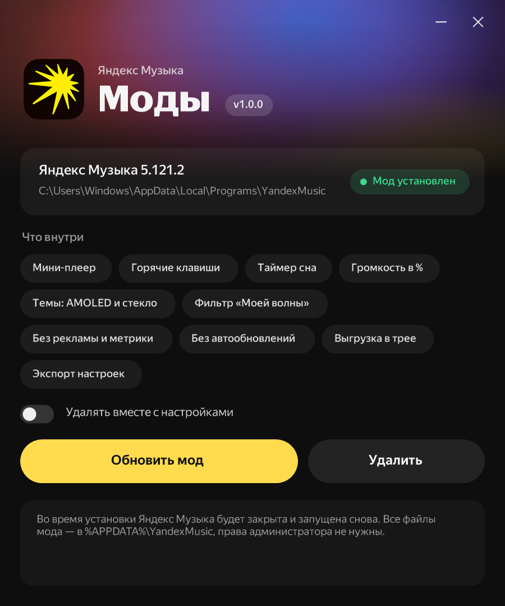
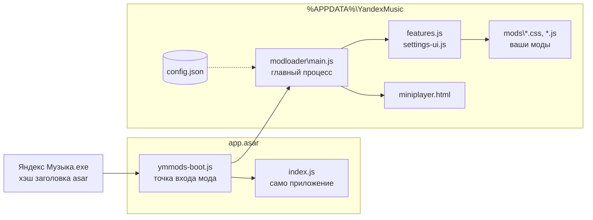

<div align="center">


<a href="#-возможности"></a>

<p>
  <a href="https://github.com/nersuga/ymusic_mod/releases/latest"></a>
  
  
  
  
  <a href="LICENSE"></a>
</p>

<b>Неофициальные моды для десктопного клиента Яндекс Музыки.</b><br/>
Мини-плеер, горячие клавиши, темы, таймер сна, фильтр «Моей волны» — и всё это переживает обновления приложения.

<br/>



</div>

---

## ✨ Возможности

Все функции включаются и выключаются в самом приложении: **Настройки → Моды**. Интерфейс переведён на русский, английский, казахский и узбекский.

<table>
<tr>
<td width="50%" valign="top">

### 🎧 Плеер
- **Мини-плеер** — компактная «пилюля» или крупная карточка с обложкой и прогрессом; иконки самой Яндекс Музыки, закрепление поверх окон, прилипание к краям экрана с пружинной анимацией
- **Открыть мини-плеер** можно кнопкой в нижней панели плеера, пунктом в меню «⋯» «Моей волны», из трея, в настройках или <kbd>Ctrl</kbd>+<kbd>Alt</kbd>+<kbd>M</kbd>
- **Кнопки в панели задач** — назад / пауза / вперёд под превью окна
- **Глобальные горячие клавиши** — работают, даже когда окно свёрнуто; переназначаются в настройках, есть перемешивание, повтор и дизлайк
- **Качество трека** — кодек и битрейт играющего файла: на «Моей волне» над версией приложения, на остальных страницах в панели плеера
- **Поиск в «Добавить в плейлист»** — когда плейлистов много
- **Таймер сна** — пауза через 15–90 минут или после текущего трека, из настроек и меню трея
- **Громкость в процентах** — число прямо в ползунке громкости

</td>
<td width="50%" valign="top">

### 🎨 Внешний вид
- **Темы** — AMOLED (чистый чёрный), «Стекло» (размытая обложка трека с плавной сменой), «Контраст»
- **Кнопки окна в стиле Яндекс Музыки** вместо стандартных
- **Переделанное окно настроек «Моей волны»** и стеклянное меню профиля
- **Масштаб интерфейса** 90–150% — в настройках или <kbd>Ctrl</kbd>+<kbd>=</kbd> / <kbd>−</kbd> / <kbd>0</kbd>
- **Скрытие лишнего** — «Концерты», «Книги и подкасты», промо Плюса, карточка ИИ-фактов
- **Исправление обрезки** анимации «Моей волны» сверху и справа

</td>
</tr>
<tr>
<td width="50%" valign="top">

### 🌊 «Моя волна»
- **Фильтр карусели** — оставьте только нужные плитки
- **Без бесконечной прокрутки**; если плитки помещаются — карусель статична и выровнена по дуге
- **Плитка «Настроить волну»** — показать или скрыть
- **Кнопка повтора трека** прямо в панели волны (вместо пункта в меню «⋯»)
- **«Скачать» в меню «⋯» волны** — встроенное скачивание Яндекс Музыки для офлайна, как в меню трека
- **Режимы анимации** — всегда / только когда окно в фокусе / выключена (главная нагрузка на видеокарту: выключение снижает её примерно на треть)

</td>
<td width="50%" valign="top">

### 🛡 Приватность и ресурсы
- **Блокировка Яндекс Метрики** и вебвизора (история и рекомендации не страдают)
- **Блокировка рекламы**
- **Отключение автообновлений** и плашки «доступна новая версия»
- **Выгрузка интерфейса в трее** — пока окно свёрнуто, работает только плеер
- **Экспорт / импорт** всех настроек мода одним файлом

</td>
</tr>
<tr>
<td width="50%" valign="top">

### 🔗 Интеграции
- **Статус в Discord** — «Слушает …» с обложкой, временем трека и кнопкой «Слушать в Яндекс Музыке»
- **Скробблинг в Last.fm** — «сейчас играет» и скробблы по правилам Last.fm (половина трека или 4 минуты), повторы тоже считаются

</td>
<td width="50%" valign="top">

### 💾 Хранилище
- **Размер скачанного и кеша** в настройках, очистка кеша в один клик (скачанные треки и вход не трогаются)
- **Перенос данных плеера** — скачанные треки, кеш и вход можно перенести на другой диск; перенос выполняется при следующем запуске, копия сверяется перед удалением старой

</td>
</tr>
</table>

### ⌨️ Горячие клавиши по умолчанию

| Действие | Клавиши |
|---|---|
| Пауза / воспроизведение | <kbd>Ctrl</kbd> + <kbd>Alt</kbd> + <kbd>P</kbd> |
| Следующий трек | <kbd>Ctrl</kbd> + <kbd>Alt</kbd> + <kbd>→</kbd> |
| Предыдущий трек | <kbd>Ctrl</kbd> + <kbd>Alt</kbd> + <kbd>←</kbd> |
| Нравится | <kbd>Ctrl</kbd> + <kbd>Alt</kbd> + <kbd>L</kbd> |
| Громкость + / − | <kbd>Ctrl</kbd> + <kbd>Alt</kbd> + <kbd>↑</kbd> / <kbd>↓</kbd> |
| Мини-плеер | <kbd>Ctrl</kbd> + <kbd>Alt</kbd> + <kbd>M</kbd> |
| Перемешать · Повтор · Не нравится | не заданы — назначьте в настройках |

> Повтор в «Моей волне» переключает «трек / выключен»: повтор всего списка там не бывает.

---

## 📦 Установка

1. Установите [Яндекс Музыку для Windows](https://music.yandex.ru/download/), если её ещё нет.
2. Скачайте `YandexMusicMods-Setup-x.y.z.exe` из [**Releases**](https://github.com/nersuga/ymusic_mod/releases/latest).
3. Запустите и нажмите **«Установить»**. Яндекс Музыка перезапустится уже с модами.

> [!NOTE]
> Установщик не подписан, поэтому Windows может показать «Система Windows защитила ваш компьютер». Нажмите **«Подробнее» → «Выполнить в любом случае»**. Сверить файл можно по SHA-256 из `.sha256` рядом с релизом.

**Обновления мода** — мод сам проверяет [релизы](https://github.com/nersuga/ymusic_mod/releases) при запуске и раз в 6 часов. Когда выходит новая версия, появляется уведомление, а в **Настройки → Моды → Обновления мода** — кнопка **«Обновить до …»**: мод скачает установщик, сверит его SHA-256 с файлом `.sha256` из релиза и установит (Яндекс Музыка перезапустится). С переключателем **«Обновлять автоматически»** обновление скачивается в фоне и ставится, когда вы закрываете приложение.

**Удаление** — тот же установщик → «Удалить» (или «Параметры → Приложения → Установленные приложения → Моды для Яндекс Музыки»). Возвращается оригинальный файл приложения, настройки можно сохранить или стереть.

<details>
<summary><b>Установка без окна (для скриптов)</b></summary>

```powershell
YandexMusicMods-Setup-1.0.0.exe -Action install -Silent
YandexMusicMods-Setup-1.0.0.exe -Action uninstall -Silent -RemoveSettings
```

Код выхода `0` — успех. Дополнительно: `-AppDir <папка>` — другая копия приложения, `-NoLaunch` — не запускать Яндекс Музыку после установки.

</details>

---

## ⚙️ Как это устроено

Electron-приложение хранит код в `resources\app.asar`, а в exe вшит SHA-256 заголовка этого архива (fuse `EnableEmbeddedAsarIntegrityValidation`). Мод меняет в архиве минимум — точку входа — и записывает в exe новый хэш. Вся логика живёт снаружи, в `%APPDATA%\YandexMusic`, и использует только публичные API Electron, поэтому почти не зависит от версии приложения.



**Обновления приложения.** Когда Яндекс Музыка ставит обновление, установщик заменяет `app.asar` и мод пропадает. Поэтому перед выходом приложения мод запускает `watch-update.ps1`: тот дожидается окончания установки, собирает новый `app.asar` из свежей версии (`patcher.js`, запущенный самим exe приложения в режиме Node), пишет хэш в exe и запускает приложение. Если что-то пошло не так — откат к предыдущему файлу. Вручную то же самое делает `modloader\repair.cmd`.

<details>
<summary><b>Как включить статус в Discord</b></summary>

Discord показывает в статусе имя приложения, поэтому нужно своё (это бесплатно и занимает минуту):

1. Откройте [discord.com/developers/applications](https://discord.com/developers/applications) → **New Application**, назовите, например, «Яндекс Музыка».
2. На странице **General Information** скопируйте **Application ID**.
3. В Яндекс Музыке: **Настройки → Моды → Интеграции** — вставьте ID и включите «Статус в Discord». Discord должен быть запущен.

</details>

<details>
<summary><b>Как подключить Last.fm</b></summary>

1. Создайте ключ API на [last.fm/api/account/create](https://www.last.fm/api/account/create) (поле Callback URL можно оставить пустым).
2. В **Настройки → Моды → Интеграции** вставьте **API key** и **Shared secret**, нажмите **«Войти»** и разрешите доступ в открывшемся браузере.
3. Включите «Скробблинг в Last.fm».

Ключ и сессия хранятся только у вас в `config.json` и не попадают в экспорт настроек.

</details>

<details>
<summary><b>Свои моды</b></summary>

Любой `.css` или `.js` в `%APPDATA%\YandexMusic\mods` подключается к странице приложения; CSS обновляется на лету при сохранении. Файлы с `_` в начале имени не загружаются — так моды отключаются (это же делает переключатель в настройках). <kbd>F12</kbd> — DevTools, <kbd>F5</kbd> — перезагрузка страницы.

Пример — `mods/_hello.js` (выключен): уберите `_` из имени, и при запуске появится уведомление.

</details>

<details>
<summary><b>Настройки в config.json</b></summary>

Всё настраивается из интерфейса, но можно править и `%APPDATA%\YandexMusic\mods\config.json`:

| Ключ | По умолчанию | Что делает |
|---|---|---|
| `disableUpdates` | `true` | не проверять и не ставить обновления |
| `trayUnloadWhenPaused` / `trayUnloadDelaySec` | `true` / `30` | выгружать интерфейс в трее, если музыка на паузе |
| `trayTrimWhenPlaying` / `trayTrimDelaySec` | `true` / `15` | сжимать память в трее во время воспроизведения |
| `theme` | `"default"` | `default` · `amoled` · `glass` · `contrast` |
| `vibeAnimation` | `"on"` | `on` · `focus` · `off` |
| `wheelFilter` / `wheelKeep` | `false` / `[]` | фильтр карусели «Моей волны» и список оставляемых плиток |
| `wheelNoLoop` | `true` | без бесконечной прокрутки карусели |
| `blockMetrics` / `blockAds` | `true` / `true` | блокировка метрики и рекламы |
| `showVolumePercent` | `true` | громкость в процентах |
| `hideWordsCard` · `hideConcerts` · `hideNonMusic` · `hidePlusPromo` | `false` | скрытие разделов |
| `hotkeysEnabled` / `hotkeys` | `true` / см. выше | глобальные горячие клавиши |
| `miniPlayerOnTop` / `miniPlayerLarge` | `true` / `false` | мини-плеер поверх окон / крупная карточка |
| `thumbarButtons` | `true` | кнопки в превью на панели задач |
| `showQuality` / `playlistSearch` | `true` / `true` | качество трека, поиск в меню плейлистов |
| `zoomFactor` | `1` | масштаб интерфейса (0.75–2) |
| `discordRpc` / `discordClientId` / `discordShowPaused` | `false` / `""` / `false` | статус в Discord |
| `lastfmEnabled` / `lastfmApiKey` / `lastfmApiSecret` | `false` / `""` / `""` | скробблинг в Last.fm |
| `sessionDataDir` | `""` | папка данных плеера (меняется кнопкой «Перенести…») |
| `modAutoUpdate` | `false` | ставить обновления мода автоматически при закрытии приложения |

</details>

<details>
<summary><b>Если что-то пошло не так</b></summary>

- **«app.asar занят другой программой»** — чаще всего это VS Code или другое Electron-приложение, в котором открыта папка Яндекс Музыки. Закройте его и повторите.
- **Приложение обновилось, а мод пропал** — запустите установщик ещё раз или `%APPDATA%\YandexMusic\modloader\repair.cmd`.
- **Приложение не запускается** — удалите мод установщиком или переустановите Яндекс Музыку с сайта: оригинальный exe и `app.asar` вернутся.
- Журнал патчера: `%APPDATA%\YandexMusic\modloader\watch.log`.

</details>

---

## 🛠 Сборка из исходников

Нужны только Windows и [Node.js](https://nodejs.org/) (для проверки синтаксиса). Компилятор C# берётся из .NET Framework 4, который есть в любой Windows 10/11.

```powershell
git clone https://github.com/nersuga/ymusic_mod.git
cd ymusic_mod
powershell -ExecutionPolicy Bypass -File build.ps1 -Version 1.0.0
# -> dist\YandexMusicMods-Setup-1.0.0.exe
```

Подпись: `build.ps1 -Version 1.0.0 -CertThumbprint <отпечаток>` (сертификат из `Cert:\CurrentUser\My`) или `-PfxPath cert.pfx`. Подписывается SHA-256 с меткой времени.

Во время разработки удобно править файлы прямо в установленном моде и забирать их в репозиторий: `tools\sync.ps1 pull` (обратно — `tools\sync.ps1 push`).

<details>
<summary><b>Структура репозитория</b></summary>

```
modloader/            код мода (копируется в %APPDATA%\YandexMusic\modloader)
  main.js               главный процесс: настройки, трей, хоткеи, мини-плеер, фильтры запросов
  preload.js            мост window.ymMods для страницы
  features.js           функции на странице: громкость в %, обложка для темы «Стекло», состояние плеера
  settings-ui.js        раздел «Моды» в настройках приложения (ru/en/kk/uz)
  miniplayer.html       мини-плеер (+ mini-preload.js)
  thumbar.js            кнопки в превью на панели задач (иконки рисуются в PNG на лету)
  discord.js            статус в Discord через локальный канал Discord (без зависимостей)
  lastfm.js             скробблер Last.fm
  storage.js            размер скачанного и кеша, перенос данных плеера
  updater.js            проверка релизов на GitHub, скачивание и проверка установщика
  patcher.js            сборка app.asar с точкой входа мода и патчами карусели
  watch-update.ps1      применение патча после обновления, ремонт и удаление
  repair.cmd            ручной ремонт
mods/                 CSS/JS-моды по умолчанию (копируются в %APPDATA%\YandexMusic\mods)
installer/            Setup.exe (C#, окно установщика) и installer.ps1 (логика)
tools/sync.ps1        синхронизация репозитория с установленным модом
build.ps1             сборка установщика
```

</details>

---

## 📄 Лицензия

[GNU GPL v3.0](LICENSE). Код можно свободно использовать, изменять и распространять, но изменённые версии при распространении должны оставаться открытыми и под той же лицензией.

Лицензия распространяется только на код этого репозитория, не на Яндекс Музыку.

---

<div align="center">

<sub>
Проект не связан с ООО «Яндекс» и не одобрен им. «Яндекс Музыка» — товарный знак ООО «Яндекс».<br/>
Мод изменяет файлы установленного приложения — используйте на свой страх и риск.<br/>
Шрифты и иконки Яндекса в репозиторий не входят: установщик берёт их из уже установленного приложения.
</sub>


</div>
