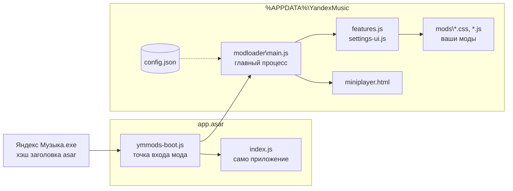

<p align="center"></p>

<h1 align="center">ymusic_mod</h1>

<p align="center">
  <a href="https://github.com/nersuga/ymusic_mod/releases/latest"></a>
  <a href="LICENSE"></a>
</p>

Неофициальные моды для десктопной Яндекс Музыки на Windows 10 и 11: мини-плеер, глобальные горячие клавиши, темы, интеграции с Discord и Last.fm и ещё несколько десятков мелочей. Мод ставится без прав администратора и сам восстанавливается после обновлений приложения.

<p align="center"></p>

## Установка

1. Установите [Яндекс Музыку для Windows](https://music.yandex.ru/download/), если её ещё нет.
2. Скачайте `YandexMusicMods-Setup-x.y.z.exe` со страницы [Releases](https://github.com/nersuga/ymusic_mod/releases/latest).
3. Запустите и нажмите «Установить». Яндекс Музыка перезапустится уже с модами.

Установщик не подписан, поэтому Windows SmartScreen может его остановить: «Подробнее» → «Выполнить в любом случае». Контрольная сумма SHA-256 лежит в релизе рядом с exe.

Все функции включаются в самом приложении: **Настройки → Моды**. Интерфейс мода переведён на русский, английский, казахский и узбекский.

### Обновление и удаление

Мод проверяет релизы на GitHub при запуске и раз в 6 часов. Если есть новая версия, в «Настройки → Моды → Обновления мода» появится кнопка «Обновить до …». Мод скачает установщик, сверит SHA-256 и поставит его. Если включить «Обновлять автоматически», обновление скачается в фоне и установится при закрытии приложения.

Удалить мод можно тем же установщиком или через «Параметры → Приложения → Установленные приложения». Оригинальные файлы приложения вернутся на место, настройки мода можно оставить или стереть.

Для скриптов есть тихий режим:

```powershell
YandexMusicMods-Setup-1.2.3.exe -Action install -Silent
YandexMusicMods-Setup-1.2.3.exe -Action uninstall -Silent -RemoveSettings
```

`-AppDir <папка>` — другая копия приложения, `-NoLaunch` — не запускать её после установки. Код выхода `0` означает успех.

## Возможности

### Плеер

- Мини-плеер: компактная полоска или карточка с обложкой, поверх остальных окон, прилипает к краям экрана. Открывается кнопкой в панели плеера, из меню «⋯» на «Моей волне», из трея или по <kbd>Ctrl</kbd>+<kbd>Alt</kbd>+<kbd>M</kbd>.
- Глобальные горячие клавиши, которые работают при свёрнутом окне. Переназначаются в настройках.
- Кнопки «назад / пауза / вперёд» в превью окна на панели задач.
- Кодек и битрейт текущего трека.
- Поиск в меню «Добавить в плейлист».
- Таймер сна: через 15–90 минут или после текущего трека.
- Автопауза при блокировке компьютера и при отключении наушников.
- Громкость в процентах на ползунке.

### «Моя волна»

- Фильтр карусели: можно оставить только нужные плитки и отключить бесконечную прокрутку.
- Кнопка повтора трека прямо в панели волны.
- «Скачать» в меню «⋯» — обычное офлайн-скачивание Яндекс Музыки, как в меню трека.
- Режимы анимации фона: всегда, только когда окно в фокусе, выключена. Выключение заметно снижает нагрузку на видеокарту.

### Внешний вид

- Темы: AMOLED, «Стекло» с размытой обложкой трека на фоне, «Контраст», а на Windows 11 — Mica и Acrylic с прозрачностью окна.
- Акцент по обложке: жёлтые кнопки и логотип плавно перекрашиваются в цвет текущего трека.
- Кнопки окна и меню профиля в стиле приложения, переделанное окно настроек «Моей волны».
- Масштаб интерфейса 90–150% (<kbd>Ctrl</kbd>+<kbd>=</kbd> / <kbd>−</kbd> / <kbd>0</kbd>).
- Можно скрыть «Концерты», «Книги и подкасты», промо Плюса и карточку ИИ-фактов.

### Приватность и ресурсы

- Блокировка Яндекс Метрики, вебвизора и рекламы. Рекомендации и история от этого не страдают.
- Отключение автообновлений приложения.
- Пока окно свёрнуто в трей, интерфейс выгружается и работает только плеер.
- Размер кеша и скачанного, очистка кеша, перенос данных плеера на другой диск.
- Экспорт и импорт настроек мода одним файлом.

### Интеграции

- Статус «Слушает…» в Discord с обложкой и временем трека.
- Скробблинг в Last.fm по правилам Last.fm (половина трека или 4 минуты).
- Виджет «Сейчас играет» для OBS и локальный HTTP API для своих скриптов.

### Горячие клавиши по умолчанию

| Действие | Клавиши |
|---|---|
| Пауза / воспроизведение | <kbd>Ctrl</kbd>+<kbd>Alt</kbd>+<kbd>P</kbd> |
| Следующий / предыдущий трек | <kbd>Ctrl</kbd>+<kbd>Alt</kbd>+<kbd>→</kbd> / <kbd>←</kbd> |
| Нравится | <kbd>Ctrl</kbd>+<kbd>Alt</kbd>+<kbd>L</kbd> |
| Громкость | <kbd>Ctrl</kbd>+<kbd>Alt</kbd>+<kbd>↑</kbd> / <kbd>↓</kbd> |
| Мини-плеер | <kbd>Ctrl</kbd>+<kbd>Alt</kbd>+<kbd>M</kbd> |

Перемешивание, повтор и «Не нравится» по умолчанию без клавиш — их можно назначить в настройках.

## Настройка интеграций

<details>
<summary>Discord</summary>

Discord показывает в статусе имя приложения, поэтому понадобится своё. Это бесплатно:

1. На [discord.com/developers/applications](https://discord.com/developers/applications) нажмите New Application и назовите его, например, «Яндекс Музыка».
2. Скопируйте Application ID со страницы General Information.
3. Вставьте его в «Настройки → Моды → Интеграции» и включите статус в Discord. Discord должен быть запущен.

</details>

<details>
<summary>Last.fm</summary>

1. Создайте ключ API на [last.fm/api/account/create](https://www.last.fm/api/account/create). Callback URL можно не заполнять.
2. В «Настройки → Моды → Интеграции» вставьте API key и Shared secret, нажмите «Войти» и подтвердите доступ в браузере.
3. Включите скробблинг.

Ключ и сессия хранятся только локально и не попадают в экспорт настроек.

</details>

<details>
<summary>Виджет для OBS и локальный API</summary>

Включите «Настройки → Моды → Интеграции → Локальный API и виджет для OBS». Сервер слушает только `127.0.0.1`, порт по умолчанию — `24850`.

В OBS добавьте источник «Браузер» с адресом `http://127.0.0.1:24850/widget`, например 600×140. Параметры адреса:

| Параметр | Значения |
|---|---|
| `layout` | `card` (по умолчанию), `bar`, `minimal` |
| `hidePaused` | `1` — прятать виджет на паузе |
| `accent` | `cover` (цвет обложки), `yellow` или цвет вроде `ff5500` |
| `align` | `left`, `right` |
| `progress` | `0` — без полосы прогресса |

API:

```bash
curl http://127.0.0.1:24850/api/now          # текущий трек в JSON
curl -N http://127.0.0.1:24850/api/events    # поток изменений (Server-Sent Events)
curl -X POST -H "Authorization: Bearer <токен>" http://127.0.0.1:24850/api/cmd/next
```

Команды: `playPause`, `play`, `pause`, `next`, `prev`, `like`, `dislike`, `shuffle`, `repeat`, `volumeUp`, `volumeDown`. Токен находится в настройках рядом с адресом API. Сайты в браузере не могут обращаться к API: заголовков CORS нет, запросы с чужим `Host` отклоняются, а команды требуют токен.

</details>

## Как это устроено

Яндекс Музыка — Electron-приложение. Её код лежит в `resources\app.asar`, а в exe записан SHA-256 заголовка этого архива (fuse `EnableEmbeddedAsarIntegrityValidation`). Мод заменяет в архиве только точку входа и обновляет хэш в exe. Весь остальной код лежит в `%APPDATA%\YandexMusic` и работает через публичные API Electron, поэтому почти не зависит от версии приложения.



Обновление приложения заменяет `app.asar`, и мод пропадает. Поэтому при выходе из приложения мод запускает `watch-update.ps1`. Он дожидается конца установки, заново собирает `app.asar` с точкой входа мода, записывает хэш и запускает приложение. Если сборка не удалась, возвращается предыдущий файл. Вручную то же делает `modloader\repair.cmd`.

### Свои моды

Любой `.css` или `.js` из `%APPDATA%\YandexMusic\mods` подключается к странице приложения, CSS обновляется на лету. Файлы, имя которых начинается с `_`, не загружаются — так моды и отключаются. <kbd>F12</kbd> открывает DevTools, <kbd>F5</kbd> перезагружает страницу. Для начала можно взять `mods/_hello.js`: уберите `_` из имени, и при запуске появится уведомление.

<details>
<summary>Ключи config.json</summary>

Всё настраивается из интерфейса, но файл `%APPDATA%\YandexMusic\mods\config.json` можно править и вручную.

| Ключ | По умолчанию | Назначение |
|---|---|---|
| `disableUpdates` | `true` | не проверять и не ставить обновления приложения |
| `trayUnloadWhenPaused` / `trayUnloadDelaySec` | `true` / `30` | выгружать интерфейс в трее на паузе |
| `trayTrimWhenPlaying` / `trayTrimDelaySec` | `true` / `15` | сжимать память в трее во время воспроизведения |
| `theme` | `"default"` | `default`, `amoled`, `glass`, `contrast`, `mica`, `acrylic` |
| `accentFromCover` | `false` | акцент по цвету обложки |
| `vibeAnimation` | `"on"` | `on`, `focus`, `off` |
| `wheelFilter` / `wheelKeep` / `wheelNoLoop` | `false` / `[]` / `true` | фильтр и прокрутка карусели «Моей волны» |
| `blockMetrics` / `blockAds` | `true` / `true` | блокировка метрики и рекламы |
| `showVolumePercent` / `showQuality` / `playlistSearch` | `true` | громкость в %, качество трека, поиск по плейлистам |
| `hideWordsCard` / `hideConcerts` / `hideNonMusic` / `hidePlusPromo` | `false` | скрытие разделов |
| `hotkeysEnabled` / `hotkeys` | `true` / см. выше | глобальные горячие клавиши |
| `miniPlayerOnTop` / `miniPlayerLarge` | `true` / `false` | мини-плеер поверх окон, крупная карточка |
| `thumbarButtons` | `true` | кнопки в превью на панели задач |
| `zoomFactor` | `1` | масштаб интерфейса |
| `autoPauseLock` / `autoResumeUnlock` / `autoPauseHeadphones` | `false` / `true` / `false` | автопауза |
| `discordRpc` / `discordClientId` / `discordShowPaused` | `false` / `""` / `false` | статус в Discord |
| `lastfmEnabled` / `lastfmApiKey` / `lastfmApiSecret` | `false` / `""` / `""` | Last.fm |
| `localApi` / `localApiPort` | `false` / `24850` | локальный API и виджет |
| `modAutoUpdate` | `false` | ставить обновления мода при закрытии приложения |
| `sessionDataDir` | `""` | папка данных плеера (меняется кнопкой «Перенести…») |

</details>

## Если что-то пошло не так

- «app.asar занят другой программой» — обычно это VS Code или другое Electron-приложение, в котором открыта папка Яндекс Музыки. Закройте его и повторите.
- Приложение обновилось, а мод пропал — запустите установщик ещё раз или `%APPDATA%\YandexMusic\modloader\repair.cmd`.
- Приложение не запускается — удалите мод установщиком или переустановите Яндекс Музыку с сайта.
- Журнал патчера: `%APPDATA%\YandexMusic\modloader\watch.log`.

## Сборка

Нужны Windows и [Node.js](https://nodejs.org/) (только для проверки синтаксиса). Установщик компилируется компилятором C# из .NET Framework 4, который есть в Windows 10 и 11.

```powershell
git clone https://github.com/nersuga/ymusic_mod.git
cd ymusic_mod
powershell -ExecutionPolicy Bypass -File build.ps1 -Version 1.2.3
```

Результат — `dist\YandexMusicMods-Setup-1.2.3.exe` и файл с его SHA-256. Для подписи добавьте `-CertThumbprint <отпечаток>` (сертификат из `Cert:\CurrentUser\My`) или `-PfxPath cert.pfx`.

При разработке удобно править файлы прямо в установленном моде и забирать их в репозиторий командой `tools\sync.ps1 pull`; `push` копирует в обратную сторону.

```
modloader/        код мода, ставится в %APPDATA%\YandexMusic\modloader
  main.js           главный процесс: настройки, трей, горячие клавиши, мини-плеер, фильтры запросов
  preload.js        мост window.ymMods для страницы
  features.js       функции на странице приложения
  settings-ui.js    раздел «Моды» в настройках
  miniplayer.html   мини-плеер (и mini-preload.js)
  thumbar.js        кнопки в превью на панели задач
  discord.js        статус в Discord
  lastfm.js         скробблинг в Last.fm
  storage.js        кеш и перенос данных плеера
  updater.js        обновления мода из релизов GitHub
  localapi.js       локальный HTTP API
  widget.html       виджет для OBS
  patcher.js        сборка app.asar с точкой входа мода
  watch-update.ps1  восстановление после обновления, ремонт, удаление
mods/             CSS- и JS-моды по умолчанию
installer/        Setup.exe (C#) и installer.ps1
tools/sync.ps1    синхронизация с установленным модом
build.ps1         сборка установщика
```

## Лицензия

[GPL-3.0](LICENSE). Лицензия относится только к коду этого репозитория.

Проект не связан с ООО «Яндекс». «Яндекс Музыка» — товарный знак ООО «Яндекс». Мод изменяет файлы установленного приложения, используйте его на свой риск. Шрифты и иконки Яндекса в репозиторий не входят: установщик берёт их из установленного приложения.
